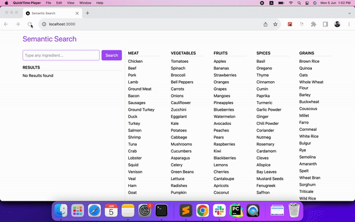

# Semantic Search

  

Semantic search, leverages natural language processing and machine learning to understand the intent and context behind a search query. It considers the meaning, relationships, and concepts associated with the words we use, resulting in more precise and meaningful search results.

Traditional search engines rely on keyword matching, which often leads to irrelevant or inaccurate results.

## Pre-requisites to run this project

1. OpenAI API Key
2. Pinecone Database ENV and KEY
3. Create an index in pinecone with cosine metric of 1536 dimensions

## Steps to run this project

1. Clone the repo
2. Run `npm install` to install all the dependencies
3. Create a `.env.local` from `env-example` file: `cp env-example .env.local`
4. Update the OpenAI and Pinecone keys in the `.env.local` file
5. Run `npm run dev` to start the project
6. This project has around 100 ingredients in the `constants.js` file. To upload those in the Pinecone Database, make an HTTP GET call to `/api/process`. This will take few seconds to update Pinecone Database. (You can move this route to a script as well.)

## Tech Stack

1. NextJS
2. TailwindCSS
3. Pinecone

## Contact

mohdejazsiddiqui@gmail.com